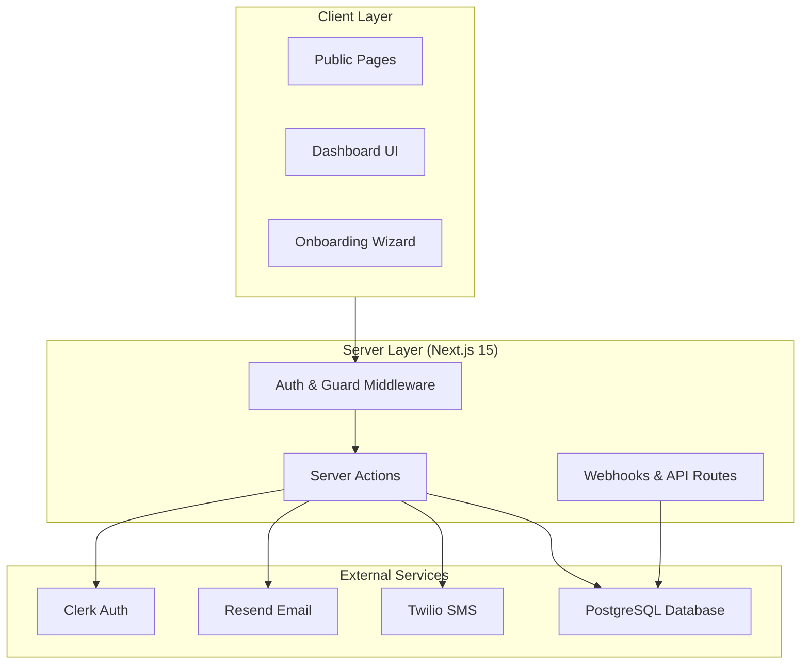
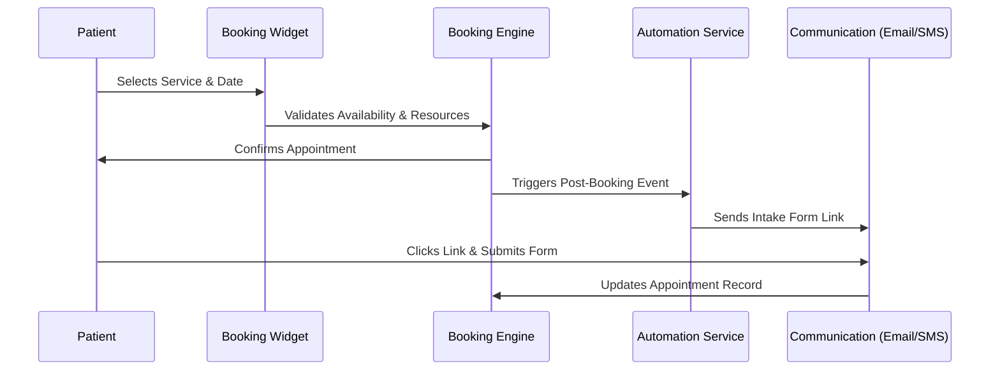
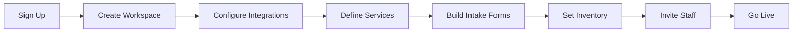
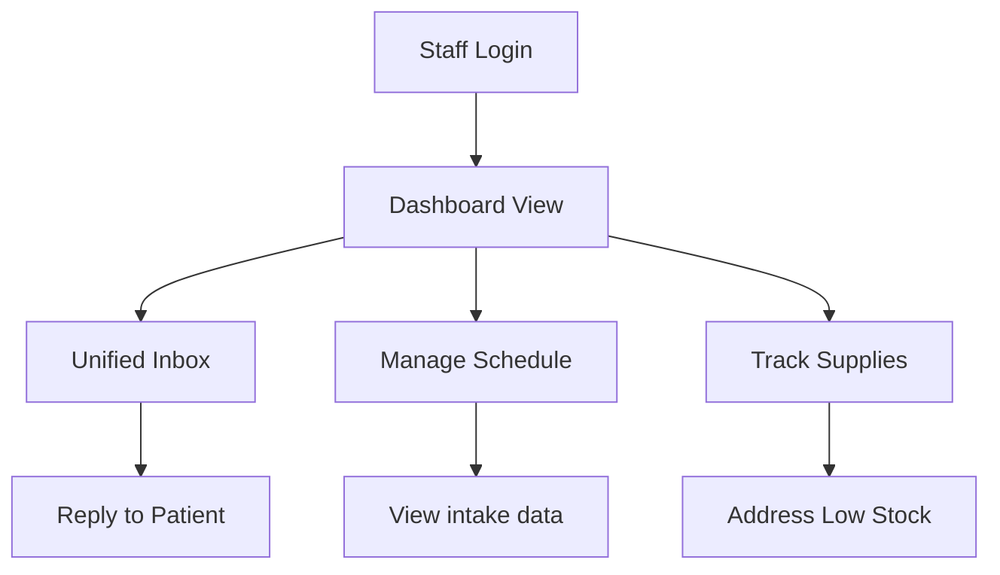

# Kanso Architecture and User Flows

This document provides a technical overview of the Kanso platform's architecture, data flow, and user journeys.

## System Architecture

Kanso is built as a highly modular Next.js application following a server-heavy "Zen" philosophy—minimizing client-side state where possible and leveraging Server Actions for reliable business logic.

### Core Engines

1.  **Onboarding Engine**: A stateful 8-step wizard that orchestrates workspace creation, integration activation, and organization member management.
2.  **Booking Engine**: Handles complex availability logic, including clinical buffer times, service-specific durations, and resource requirements (inventory).
3.  **Communication Service**: A unified abstraction layer for sending transaction-based clinical alerts and managing bidirectional patient messaging across Email and SMS.
4.  **Automation Engine**: Trigger-based system that executes rules (e.g., "Send intake form 2 hours after booking") and logs execution status.

---

## User Flows

### 1. Patient/Customer Journey

The path from discovery to clinical appointment.

### 2. Business Owner (Onboarding)

The administrative setup path.

### 3. Operational Staff (Daily Use)

Managing the practice through the dashboard.

---

## Data Model (Prisma Schema Highlights)

The schema is optimized for multi-tenancy using `workspaceId` or `clerkOrgId` as the primary grouping key.

- **Workspace**: The central tenant record holding branding, configuration, and state.
- **Booking**: The core event record, linking `Service`, `Contact`, and `FormSubmission`.
- **Contact**: The "Master Record" for a patient, aggregating all conversations and bookings.
- **FormSubmission**: Stores dynamic clinical data in a JSON/String format to allow for flexible intake fields.

## Technical Rationale

- **Next.js Server Actions**: Used instead of a REST API to ensure type safety between the frontend and database, and to simplify the authentication flow.
- **PostgreSQL**: Selected for its robust support for relational data and reliability in clinical settings where data integrity is paramount.
- **Mermaid/Markdown**: Documentation is kept code-adjacent to ensure it evolves with the platform.

---
*Kanso: Minimalist Architecture, Maximal Performance.*
